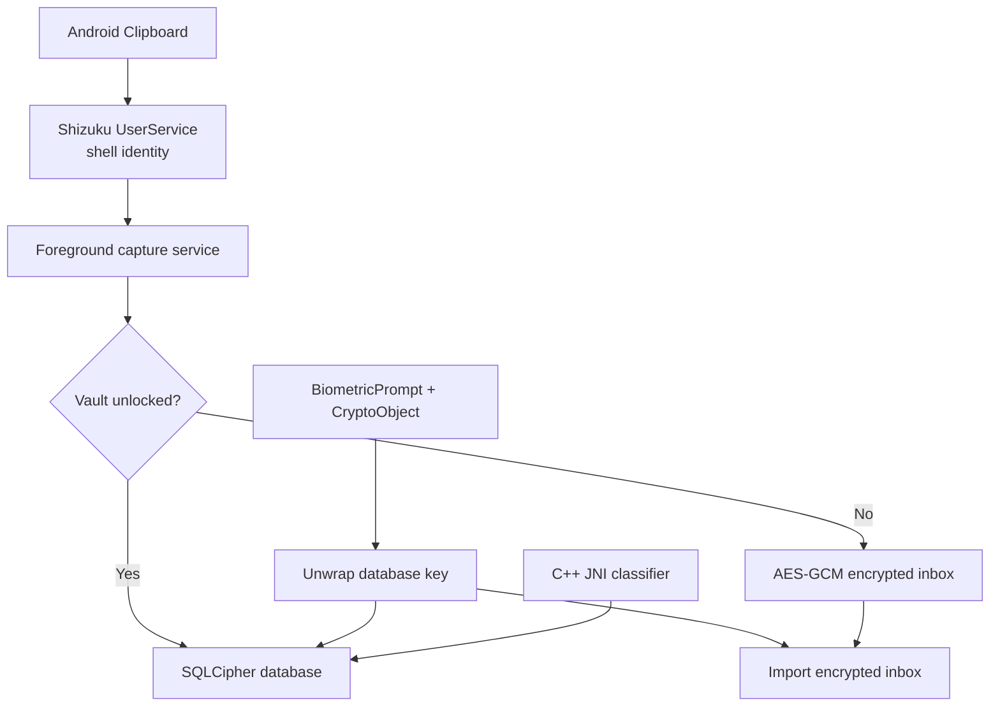

# ClipVault

**English** · [فارسی](README_FA.md)

ClipVault is a local-first clipboard history for Android. It is built around a simple promise: copied text stays useful without quietly becoming cloud data.

The app keeps a searchable history, groups entries by date and content type, and protects the database key with strong biometric authentication. Its interface is Persian-first and fully right-to-left, while the storage and capture layers are intentionally small enough to audit.

## Why this project exists

Android 10 restricted clipboard access for apps that are not in the foreground. Accessibility services are sometimes used as a workaround, but that grants far more visibility than a clipboard manager should need. ClipVault instead uses an explicitly approved [Shizuku](https://shizuku.rikka.app/) UserService whose only job is to read the current clipboard.

That platform decision shapes the rest of the project: capture is visible through a foreground notification, the privileged boundary is narrow, and the app still works as a normal encrypted vault when Shizuku is unavailable.

## What it does

- Database-key unlock through `BiometricPrompt`, `BIOMETRIC_STRONG`, and `CryptoObject`
- Full SQLCipher database encryption with a random 256-bit key
- AES-256-GCM encrypted staging inbox while the main vault is locked
- Background capture through Shizuku and a transparent foreground service
- Native classification for Instagram, YouTube, links, dates, Persian, English, and long text
- Live search, deduplication, favorites, copy, and delete actions
- Date-grouped, fully right-to-left Material interface
- One-, three-, six-month, or unlimited retention policies
- Optional OTP and password-like content detection
- Automatic locking, screenshot protection, disabled backups, and session-key wiping
- Native-library alignment for 16 KB page-size Android devices

## Architecture



| Layer | Technology |
|---|---|
| UI and lifecycle | Java 17, Material Components, RecyclerView |
| Authentication | AndroidX BiometricPrompt and Android Keystore |
| Database | SQLCipher for Android |
| Background capture | Foreground Service and Shizuku UserService/AIDL |
| Text processing | C++17, JNI, and Android NDK |
| Scheduled retention | AndroidX WorkManager |

## Engineering decisions

**Biometrics protect the key, not just the screen.** `BiometricPrompt` receives a real `CryptoObject`. Successful authentication unwraps the SQLCipher key; dismissing a dialog or bypassing an Activity does not unlock the database.

**Locked capture uses a separate store.** The main database key should not remain in memory while the vault is locked. New clips are therefore written to an AES-GCM staging inbox backed by Android Keystore and imported only after the next biometric unlock.

**Shizuku is a narrow compatibility layer.** Privileged code lives in a small AIDL UserService. It does not expose arbitrary command execution, inspect other app screens, or write system state.

**Native code has a limited role.** C++ handles deterministic normalization and multi-label classification. Lifecycle, cryptography orchestration, persistence, and UI remain in Java where Android behavior is easier to review.

**There is no network path.** The manifest requests no Internet permission. There are no accounts, analytics, remote backups, or telemetry.

## Non-goals

- Cloud synchronization or cross-device history
- Silently starting Shizuku or bypassing Android security controls
- Treating clipboard storage as a password manager
- Claiming identical behavior on every vendor ROM without device testing

## Build requirements

- Android Studio or JDK 17/21
- Android SDK Platform 35
- Android NDK `27.2.12479018`
- CMake `3.22.1`

The required SDK, NDK, and CMake versions are declared in [app/build.gradle](app/build.gradle). Do not commit `local.properties`; Android Studio generates it for each machine.

## Build and test

Windows:

```powershell
$env:JAVA_HOME = "C:\Program Files\Android\Android Studio\jbr"
.\gradlew.bat testDebugUnitTest lintDebug assembleDebug
```

Linux/macOS:

```bash
./gradlew testDebugUnitTest lintDebug assembleDebug
```

The installable debug APK is generated at:

```text
app/build/outputs/apk/debug/app-debug.apk
```

Public releases require your own signing configuration. No release keystore or signing password is included in this repository.

## Device setup

1. Enroll a strong fingerprint in Android security settings.
2. Install and start [Shizuku](https://shizuku.rikka.app/download/) through wireless debugging, ADB, or root.
3. Install the debug APK:

   ```bash
   adb install -r app/build/outputs/apk/debug/app-debug.apk
   ```

4. Open ClipVault and create the vault with your fingerprint.
5. Enable permanent capture and approve the Shizuku and notification permissions.

In non-root mode, Shizuku must be started again after each reboot. See the [official Shizuku setup guide](https://shizuku.rikka.app/guide/setup/).

## Security model

- The random SQLCipher key is never stored on disk in plaintext.
- The database key is wrapped with AES-GCM using a non-exportable Android Keystore key.
- Every unwrap requires biometric authentication.
- Biometric enrollment changes invalidate the previous wrapping key.
- Clips captured while locked are encrypted with an independent Keystore-backed key before being written to disk.
- Shizuku is restricted to a small clipboard-reading UserService; the app does not expose arbitrary shell-command execution.
- The foreground notification never contains clipboard text.

See [SECURITY.md](SECURITY.md) for the full threat model and defensive decisions.

## Project layout

```text
app/src/main/
├── aidl/        Restricted Shizuku UserService interface
├── cpp/         Native text normalization and classification
├── java/        UI, security, database, and capture service
└── res/         Material and Persian RTL resources
```

## Platform limitation

Android 10 and newer restrict clipboard access for applications that are not focused, except for the default input method. Permanent capture therefore requires Shizuku and a foreground service. The UserService uses an internal clipboard API, so heavily customized ROMs may require device-specific adaptation.

## Privacy

All processing happens on-device. Clipboard content is never sent to a server because the application has no network permission or networking code.

## Project status

The current version has been tested end-to-end on a physical Android 13 device and on an Android 17/API 37 emulator with a 16 KB page size. The core workflow is working, but this is still an early project: additional vendor-ROM testing and an independent security review are appropriate before treating it as production software.
