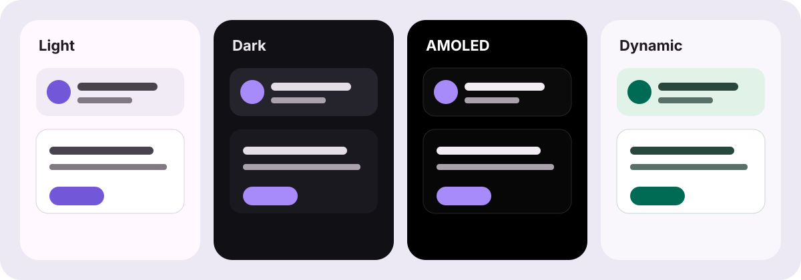
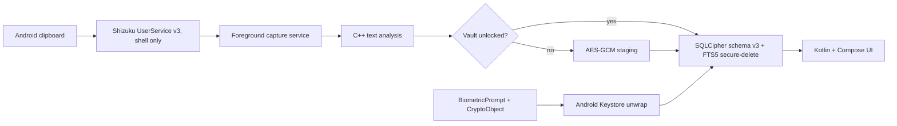

# ClipVault

ClipVault is an offline-first encrypted clipboard archive for Android. It captures text through a narrowly scoped Shizuku bridge, stores the vault in SQLCipher, and requires a strong biometric-backed Android Keystore key for every unlock.

[فارسی](README_FA.md) · [Security](SECURITY.md) · [Architecture](docs/ARCHITECTURE.md) · [Backup format](docs/BACKUP_FORMAT.md)



## What it does

- Captures clipboard text in the background through Shizuku with an event callback and adaptive polling fallback.
- Keeps the primary database encrypted with SQLCipher and stages locked-state captures using AES-256-GCM.
- Unlocks the database key only through `BiometricPrompt`, `BIOMETRIC_STRONG`, a real `CryptoObject`, and Android Keystore.
- Classifies Instagram, YouTube, Telegram, TikTok, X, GitHub, links, dates, Persian, English, mixed text, email, phone, code and JSON in the native C++ layer.
- Provides encrypted FTS5 search, advanced filters, smart collections, custom collections, tags, notes, pinning, favorites and complete multi-selection actions.
- Uses recoverable deletion with a 30-day Trash and retention policies from one month to forever or 7–365 custom days.
- Exports and imports versioned `.cvault` files protected with Argon2id and AES-256-GCM.
- Offers System, Light, Dark and AMOLED themes, Android 12+ Dynamic Color, six accent palettes and live preview.
- Supports Persian RTL and English LTR layouts.
- Quick paste window for DeX and hardware keyboards: long-press the app icon (or the DeX taskbar icon) → **Quick paste**, type to search, ↑/↓ to pick, Enter to copy, Esc to close, then Ctrl+V in the original app. It never pastes by itself.

ClipVault has no `INTERNET` permission, analytics, account system, cloud sync or telemetry.

## Architecture



The UI and presentation layer use Kotlin, Compose, Navigation, StateFlow and Paging 3. Security, SQLCipher persistence and Shizuku lifecycle code remain explicit Java boundaries. Deterministic text analysis lives in C++20/JNI. See [Architecture](docs/ARCHITECTURE.md) for the data flow and invariants.

## Build

Requirements:

- Android Studio with JDK 17 or 21
- Android SDK Platform `37.0`, target SDK 36
- Android NDK `27.2.12479018`
- CMake `3.22.1`

Windows:

```powershell
$env:JAVA_HOME = "C:\Program Files\Android\Android Studio\jbr"
$env:ANDROID_HOME = "$env:LOCALAPPDATA\Android\Sdk"
.\gradlew.bat testDebugUnitTest lintDebug externalNativeBuildDebug assembleDebug
```

Linux/macOS:

```bash
./gradlew testDebugUnitTest lintDebug externalNativeBuildDebug assembleDebug
```

The debug APK is written to `app/build/outputs/apk/debug/app-debug.apk`. Release signing keys must be configured outside the repository; no keystore or signing secret belongs in source control.

## Device setup

1. Enroll a strong fingerprint or other `BIOMETRIC_STRONG` credential.
2. Install and start [Shizuku](https://shizuku.rikka.app/guide/setup/) using wireless debugging or ADB. Root and Sui backends are refused because clipboard access only needs the shell identity.
3. Install the APK with `adb install -r app/build/outputs/apk/debug/app-debug.apk`.
4. Open ClipVault and create the biometric-protected vault.
5. Grant the Shizuku and notification permissions, then enable capture in Settings or the Quick Settings tile.

Shizuku normally needs to be started again after a reboot on non-rooted devices. Android and vendor ROM changes can affect hidden clipboard APIs; ClipVault reports bridge health and falls back to adaptive polling instead of hiding failures.

## Security boundary

Biometrics protect key use, not merely a screen. The SQLCipher key is random, never persisted as plaintext, and is wrapped by a non-exportable Keystore AES-GCM key. Clipboard contents are never logged. Screenshots and recent-app previews are blocked with `FLAG_SECURE`. Android cloud backup and device transfer are disabled.

Read [SECURITY.md](SECURITY.md) and the [threat model](docs/THREAT_MODEL.md) before treating the project as a password manager or a substitute for an independently audited secrets vault.

## Status

Version `2.0.0` builds against API 37 and compiles all four Android ABIs. Its device suite covers all theme modes, navigation, multi-selection, Trash recovery, encrypted backup failure modes, native/fallback parity, the real v1 → v2 migration and indexed search over 20,000 encrypted clips. The security/data suite and a live Shizuku protocol-v2 UserService bind have also passed on an Android 13 HyperOS device. Shizuku clipboard behavior still needs validation across more vendor ROMs before a production security claim would be responsible.
