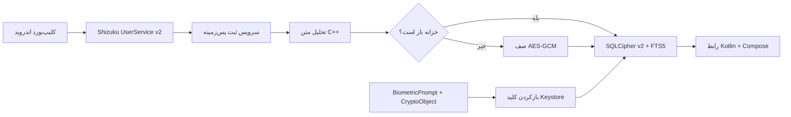

# ClipVault

ClipVault یک آرشیو آفلاین و رمزنگاری‌شده برای تاریخچهٔ کلیپ‌بورد اندروید است. متن‌ها از طریق یک پل محدود Shizuku دریافت می‌شوند، دیتابیس اصلی با SQLCipher رمز می‌شود و بازکردن کلید آن همیشه به احراز هویت بیومتریک قوی در Android Keystore وابسته است.

[English](README.md) · [امنیت](SECURITY.md) · [معماری](docs/ARCHITECTURE.md) · [فرمت پشتیبان](docs/BACKUP_FORMAT.md)


## قابلیت‌ها

- ثبت پس‌زمینهٔ متن کلیپ‌بورد با Shizuku، callback رویداد و polling تطبیقی به‌عنوان fallback
- دیتابیس SQLCipher و صف AES-256-GCM مستقل برای متن‌هایی که هنگام قفل دریافت می‌شوند
- بازکردن کلید با `BiometricPrompt`، سطح `BIOMETRIC_STRONG`، یک `CryptoObject` واقعی و Android Keystore
- تشخیص بومی Instagram، YouTube، Telegram، TikTok، X، GitHub، لینک، تاریخ، فارسی، انگلیسی، متن ترکیبی، ایمیل، تلفن، کد و JSON
- جست‌وجوی رمزنگاری‌شدهٔ FTS5، فیلترهای پیشرفته، دسته‌های هوشمند، مجموعه و برچسب دلخواه، یادداشت، سنجاق، علاقه‌مندی و عملیات کامل انتخاب گروهی
- سطل زبالهٔ ۳۰روزه و نگهداری یک، سه، شش ماه، همیشگی یا بازهٔ سفارشی ۷ تا ۳۶۵ روز
- خروجی و ورود فایل نسخه‌دار `.cvault` با Argon2id و AES-256-GCM
- تم System، Light، Dark و AMOLED، رنگ پویای اندروید ۱۲ به بالا، شش پالت رنگ و پیش‌نمایش زنده
- رابط کامل فارسی RTL و انگلیسی LTR

برنامه مجوز `INTERNET`، آنالیتیکس، حساب کاربری، فضای ابری و telemetry ندارد.

## معماری



رابط و presentation با Kotlin، Compose، Navigation، StateFlow و Paging 3 نوشته شده است. مرزهای امنیت، SQLCipher و چرخهٔ Shizuku در Java شفاف باقی مانده‌اند و تحلیل قطعی متن در C++20/JNI اجرا می‌شود. جزئیات بیشتر در [سند معماری](docs/ARCHITECTURE.md) آمده است.

## ساخت پروژه

پیش‌نیازها:

- Android Studio و JDK 17 یا 21
- Android SDK Platform `37.0` با target SDK 36
- NDK `27.2.12479018`
- CMake `3.22.1`

روی ویندوز:

```powershell
$env:JAVA_HOME = "C:\Program Files\Android\Android Studio\jbr"
$env:ANDROID_HOME = "$env:LOCALAPPDATA\Android\Sdk"
.\gradlew.bat testDebugUnitTest lintDebug externalNativeBuildDebug assembleDebug
```

APK دیباگ در `app/build/outputs/apk/debug/app-debug.apk` ساخته می‌شود. کلید امضای release باید بیرون از repository تعریف شود و هیچ keystore یا secret نباید commit شود.

## راه‌اندازی گوشی

1. یک اثر انگشت قوی در تنظیمات امنیتی گوشی ثبت کنید.
2. [Shizuku](https://shizuku.rikka.app/guide/setup/) را با Wireless debugging، ADB یا root اجرا کنید.
3. APK را با دستور `adb install -r app/build/outputs/apk/debug/app-debug.apk` نصب کنید.
4. ClipVault را باز و خزانهٔ بیومتریک را ایجاد کنید.
5. مجوز Shizuku و اعلان را بدهید و ثبت را از تنظیمات یا Quick Settings فعال کنید.

در گوشی بدون root معمولاً پس از reboot باید Shizuku دوباره اجرا شود. API داخلی کلیپ‌بورد ممکن است بین ROMها تغییر کند؛ برنامه وضعیت bridge را شفاف نشان می‌دهد و در صورت نیاز به polling تطبیقی برمی‌گردد.

## مرز امنیتی

اثر انگشت از «استفاده از کلید» محافظت می‌کند، نه فقط از یک صفحه. کلید تصادفی SQLCipher به‌شکل plaintext ذخیره نمی‌شود و با کلید AES-GCM غیرقابل‌استخراج Keystore بسته‌بندی شده است. متن کلیپ‌بورد وارد log نمی‌شود، screenshot و recent preview با `FLAG_SECURE` بسته‌اند و backup خودکار اندروید غیرفعال است.

پیش از استفاده برای اطلاعات خیلی حساس، [SECURITY.md](SECURITY.md) و [مدل تهدید](docs/THREAT_MODEL.md) را بخوانید. این پروژه جایگزین password manager مستقل و ممیزی‌شده نیست.

## وضعیت

نسخهٔ `2.0.0` با API 37 build می‌شود و هر چهار ABI اندروید را می‌سازد. مجموعه‌تست دستگاهی آن تمام تم‌ها، ناوبری، انتخاب چندتایی، بازیابی سطل زباله، خطاهای بکاپ رمزنگاری‌شده، برابری تحلیلگر C++ و fallback، مهاجرت واقعی v1 به v2 و جست‌وجوی ایندکس‌شده میان ۲۰هزار کلیپ رمزنگاری‌شده را پوشش می‌دهد. تست‌های امنیت و داده و bind واقعی UserService پروتکل v2 به Shizuku روی یک گوشی Android 13 با HyperOS نیز پاس شده‌اند. رفتار کلیپ‌بورد Shizuku همچنان باید روی ROMهای واقعی بیشتری آزمایش شود.
