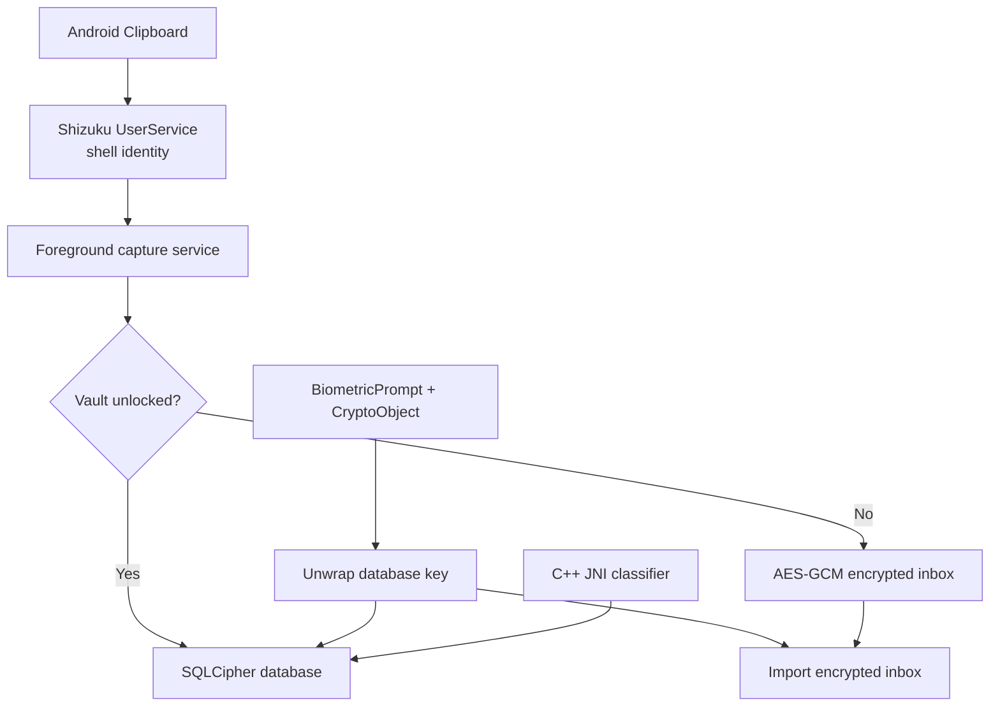

# ClipVault

[English](README.md) · **فارسی**

ClipVault یک تاریخچه‌ی کلیپ‌بورد محلی برای اندروید است. ایده‌اش ساده است: متن‌هایی که کپی می‌کنیم مفید بمانند، بدون اینکه بی‌سروصدا به داده‌ی ابری تبدیل شوند.

برنامه یک تاریخچه‌ی قابل جست‌وجو می‌سازد، ورودی‌ها را بر اساس تاریخ و نوع محتوا مرتب می‌کند و کلید دیتابیس را پشت احراز هویت بیومتریک قوی نگه می‌دارد. رابط کاربری فارسی و کاملاً راست‌به‌چپ است و لایه‌های ذخیره‌سازی و ثبت عمداً کوچک نگه داشته شده‌اند تا بتوان آن‌ها را بررسی کرد.

## چرا این پروژه ساخته شد؟

از Android 10 به بعد، برنامه‌ای که در foreground نیست نمی‌تواند آزادانه Clipboard را بخواند. بعضی ابزارها برای دورزدن این محدودیت سراغ Accessibility Service می‌روند، اما چنین مجوزی بسیار فراتر از نیاز یک مدیر کلیپ‌بورد است. ClipVault به‌جای آن از یک UserService در [Shizuku](https://shizuku.rikka.app/) استفاده می‌کند که کارش فقط خواندن Clipboard فعلی است و فعال‌شدنش به تأیید صریح کاربر نیاز دارد.

این تصمیم روی بقیه‌ی معماری هم اثر گذاشته است: ثبت پس‌زمینه اعلان قابل‌مشاهده دارد، مرز دسترسی ویژه محدود است و وقتی Shizuku در دسترس نباشد، برنامه همچنان به‌عنوان یک خزانه‌ی رمزگذاری‌شده کار می‌کند.

## چه کارهایی انجام می‌دهد؟

- بازکردن کلید دیتابیس با `BiometricPrompt`، `BIOMETRIC_STRONG` و `CryptoObject`
- دیتابیس کامل SQLCipher با کلید تصادفی ۲۵۶ بیتی
- نگهداری امن کلیپ‌های زمان قفل در inbox رمز‌شده‌ی AES-256-GCM
- ثبت پس‌زمینه با Shizuku و یک Foreground Service شفاف و قابل توقف
- دسته‌بندی خودکار اینستاگرام، یوتیوب، لینک، تاریخ، فارسی، انگلیسی و متن بلند
- جست‌وجوی زنده، حذف موارد تکراری، علاقه‌مندی، کپی مجدد و حذف
- گروه‌بندی بر اساس تاریخ و رابط کاملاً راست‌به‌چپ
- سیاست نگهداری یک، سه، شش ماه یا همیشگی
- تشخیص اختیاری OTP و متن‌های شبیه رمز عبور برای جلوگیری از ذخیره‌ی ناخواسته
- قفل خودکار، جلوگیری از screenshot، غیرفعال‌بودن backup و پاک‌سازی کلید session
- سازگاری کتابخانه‌های بومی با دستگاه‌های دارای page size شانزده کیلوبایت

## معماری



### پشته‌ی فنی

| لایه | فناوری |
|---|---|
| رابط و چرخه‌ی عمر | Java 17، Material Components، RecyclerView |
| احراز هویت | AndroidX BiometricPrompt + Android Keystore |
| دیتابیس | SQLCipher for Android |
| ثبت پس‌زمینه | Foreground Service + Shizuku UserService/AIDL |
| پردازش متن | C++17، JNI و Android NDK |
| نگهداری دوره‌ای | AndroidX WorkManager |

## تصمیم‌های مهندسی

**اثر انگشت از کلید محافظت می‌کند، نه فقط از صفحه.** `BiometricPrompt` با یک `CryptoObject` واقعی اجرا می‌شود. تنها احراز هویت موفق می‌تواند کلید SQLCipher را باز کند؛ عبور از Activity یا بستن یک دیالوگ باعث بازشدن دیتابیس نمی‌شود.

**ثبت در حالت قفل، محل ذخیره‌ی جدا دارد.** منطقی نیست کلید دیتابیس اصلی وقتی خزانه قفل است در حافظه بماند. کلیپ‌های تازه ابتدا داخل یک inbox رمز‌شده با AES-GCM و Android Keystore نوشته می‌شوند و پس از بازشدن بعدی وارد SQLCipher خواهند شد.

**Shizuku فقط یک لایه‌ی سازگاری محدود است.** کد دارای دسترسی ویژه داخل یک AIDL UserService کوچک قرار دارد. این سرویس امکان اجرای فرمان دلخواه نمی‌دهد، صفحه‌ی برنامه‌های دیگر را نمی‌بیند و تنظیمات سیستم را تغییر نمی‌دهد.

**نقش کد بومی مشخص و محدود است.** C++ فقط نرمال‌سازی قطعی و دسته‌بندی چندبرچسبی متن را انجام می‌دهد. چرخه‌ی عمر، هماهنگی رمزنگاری، ذخیره‌سازی و UI در Java باقی مانده‌اند تا رفتار اندروید قابل بررسی‌تر باشد.

**هیچ مسیر شبکه‌ای وجود ندارد.** برنامه مجوز اینترنت، حساب کاربری، analytics، backup راه‌دور یا telemetry ندارد.

## چیزهایی که هدف پروژه نیستند

- همگام‌سازی ابری یا تاریخچه‌ی مشترک بین چند دستگاه
- اجرای مخفیانه‌ی Shizuku یا عبور از کنترل‌های امنیتی اندروید
- جایگزین‌شدن با password manager
- ادعای رفتار کاملاً یکسان روی همه‌ی ROMها بدون تست واقعی

## پیش‌نیازهای بیلد

- Android Studio یا JDK 17/21
- Android SDK Platform 35
- Android NDK `27.2.12479018`
- CMake `3.22.1`

مقادیر SDK، NDK و CMake در [app/build.gradle](app/build.gradle) مشخص شده‌اند. فایل `local.properties` را commit نکنید؛ Android Studio آن را برای هر سیستم می‌سازد.

## بیلد و تست

Windows:

```powershell
$env:JAVA_HOME = "C:\Program Files\Android\Android Studio\jbr"
.\gradlew.bat testDebugUnitTest lintDebug assembleDebug
```

Linux/macOS:

```bash
./gradlew testDebugUnitTest lintDebug assembleDebug
```

APK دیباگ در مسیر زیر ساخته می‌شود:

```text
app/build/outputs/apk/debug/app-debug.apk
```

برای انتشار عمومی باید signing config و کلید انتشار خودتان را خارج از repository تعریف کنید. هیچ keystore یا رمز امضایی در پروژه قرار ندارد.

## راه‌اندازی روی گوشی

1. یک اثر انگشت قوی در تنظیمات امنیتی گوشی ثبت کنید.
2. [Shizuku](https://shizuku.rikka.app/download/) را نصب و با Wireless debugging، ADB یا root راه‌اندازی کنید.
3. APK را نصب کنید:

   ```bash
   adb install -r app/build/outputs/apk/debug/app-debug.apk
   ```

4. ClipVault را باز کنید و خزانه را با اثر انگشت ایجاد کنید.
5. «فعال‌سازی ثبت دائمی» را بزنید و مجوزهای Shizuku و اعلان را تأیید کنید.

در حالت بدون root، Shizuku پس از هر reboot باید دوباره راه‌اندازی شود. جزئیات در [راهنمای رسمی Shizuku](https://shizuku.rikka.app/guide/setup/) آمده است.

## مدل امنیتی

- کلید تصادفی SQLCipher به‌صورت plaintext روی دیسک ذخیره نمی‌شود.
- کلید دیتابیس با AES-GCM و یک کلید غیرقابل‌استخراج Android Keystore بسته‌بندی می‌شود.
- استفاده از کلید wrapping به احراز هویت بایومتریک در هر بار بازشدن وابسته است.
- تغییر enrollment اثر انگشت، کلید wrapping قبلی را نامعتبر می‌کند.
- داده‌های دریافتی هنگام قفل با کلید مستقل Keystore رمز می‌شوند و پس از unlock وارد SQLCipher می‌شوند.
- Shizuku فقط در UserService کوچک Clipboard استفاده شده و برنامه shell command دلخواه اجرا نمی‌کند.
- اعلان Foreground Service هیچ محتوای کلیپ‌بوردی نمایش نمی‌دهد.

جزئیات بیشتر را در [SECURITY.md](SECURITY.md) بخوانید.

## ساختار پروژه

```text
app/src/main/
├── aidl/        رابط محدود Shizuku UserService
├── cpp/         نرمال‌سازی و دسته‌بندی بومی متن
├── java/        UI، امنیت، دیتابیس و سرویس ثبت
└── res/         منابع Material و فارسی RTL
```

## محدودیت پلتفرم

Android 10 به بعد دسترسی Clipboard را برای برنامه‌های بدون focus، به‌جز IME پیش‌فرض، محدود کرده است. به همین دلیل ثبت دائمی به Shizuku و Foreground Service نیاز دارد. پیاده‌سازی UserService از API داخلی Clipboard استفاده می‌کند؛ ROMهای بسیار سفارشی ممکن است به تطبیق جداگانه نیاز داشته باشند.

## حریم خصوصی

تمام پردازش‌ها روی دستگاه انجام می‌شوند. محتوای Clipboard به هیچ سروری فرستاده نمی‌شود، چون برنامه نه مجوز اینترنت دارد و نه کد ارتباط شبکه‌ای.

## وضعیت پروژه

نسخه‌ی فعلی به‌صورت انتها‌به‌انتها روی یک دستگاه واقعی Android 13 و شبیه‌ساز Android 17/API 37 با page size شانزده کیلوبایت آزمایش شده است. جریان اصلی برنامه کار می‌کند، اما پروژه هنوز جوان است؛ پیش از استفاده‌ی production، تست روی ROMهای بیشتر و یک بازبینی امنیتی مستقل تصمیم منطقی‌تری خواهد بود.
